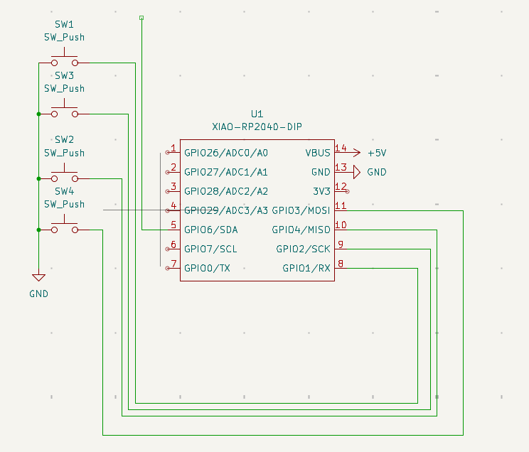
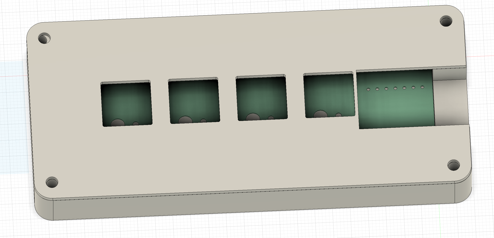
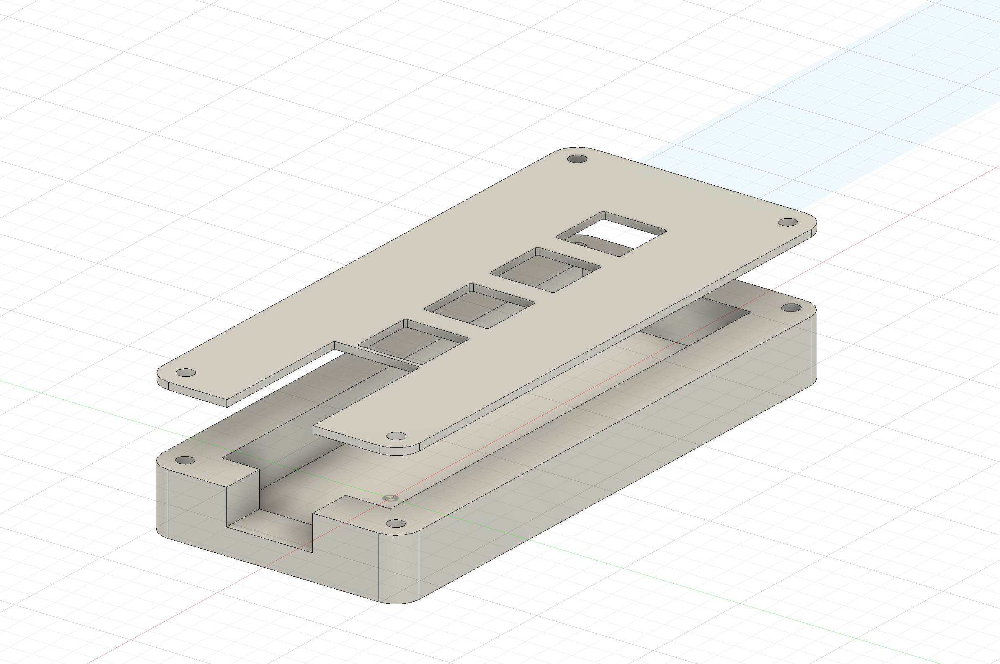

# Abdelrahman's Macropad ✨

A small, one-handed macro controller built to be portable, practical, and customizable. Perfect for travelers, streamers, hybrid workers, or anyone who wants to speed up their workflow.

---

## Overview

This macropad is designed for **speed and portability**. The macropad provides quick access to your key shortcuts, regardless of whether you're working with video, streaming, or controlling your computer's controls. Macropads allow you fast deployment; simple usage; easily stored.
---

## Features

* **Single-row design**: Simple design with a low profile
* **One-handed**: One-handed access to your frequently used macros
* **Small size**: Easily fits into a bag or sleeve
* **Fully customizable**: Every key can be programmed to a shortcut, media, or macro

---

## Why This Macropad?

This macropad is all about **speed and portability**. Whether you’re editing, streaming, or controlling your system, it gives you instant access to your most important shortcuts. It’s quick to deploy, easy to use, and just as easy to store.

---

## Schematic & PCB:

| Schematic                 | PCB Layout        | Case Fitment         |
| ------------------------- | ----------------- | -------------------- |
|  |  |  |

---

## How to Use It:

1. Connect the macropad via USB (or your preferred connection).
2. Flash your chosen keymap — either the default one or your own.
3. Assign each key to a shortcut, media control, or macro.
4. When you’re done, lay it flat and store — no cables or keys will get in the way.

---

## 📦 What You’ll Need (BOM)

| Quantity | Component          | Description          |
| -------- | ------------------ | -------------------- |
| 4        | Cherry MX Switches | Mechanical switches  |
| 1        | Seeed XIAO RP2040  | Microcontroller      |
| 4        | Blank DSA Keycaps  | Keycaps for switches |
| 4        | M3 × 16 Bolts      | Mounting hardware    |
| 4        | M3 Heatset Inserts | For secure assembly  |
| –        | 3D printed parts   | Custom case          |
